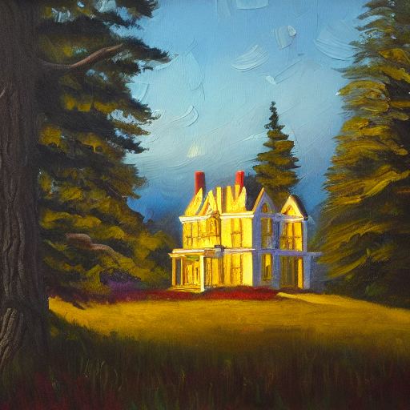
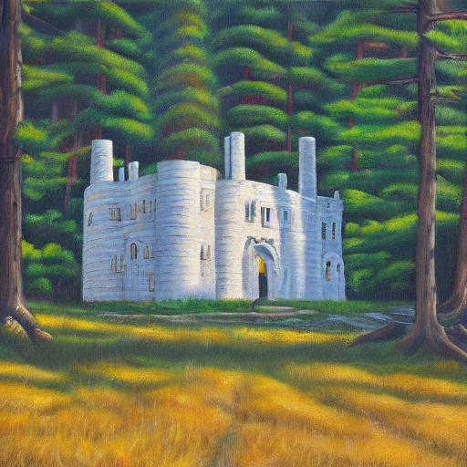
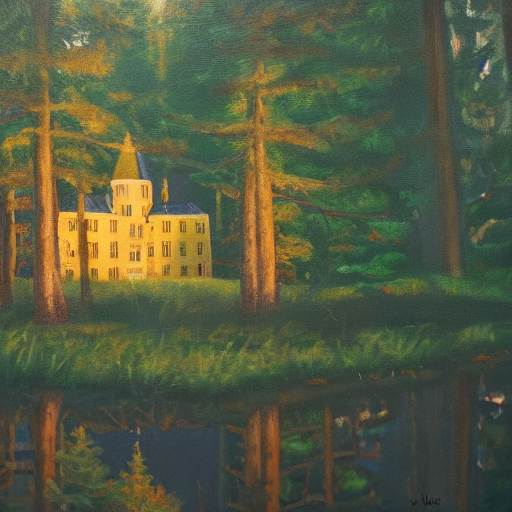
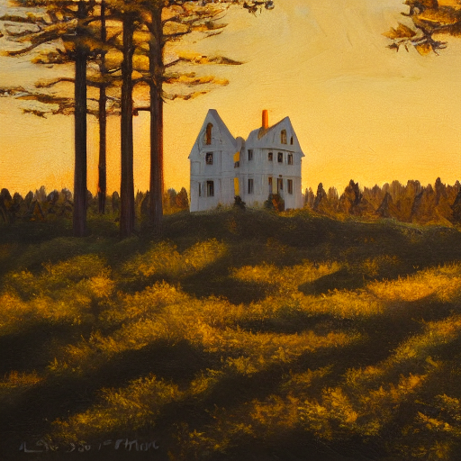

# stable-diffusion_selenium
A python script that automatically run [the Stable Diffusion Demo provided by Hugging Face](https://huggingface.co/spaces/stabilityai/stable-diffusion) by selenium and gets the generated images.  

## Dependency
- webdriver_manager
- selenium

## example
```sh
$ stable-diffusion_selenium> python main.py "Detailing oil painting of the great white castle 
on deep forest landscape, perfect lighting, golden hour, taken with Leica M11"
```
1. 
1. 
1. 
1. 